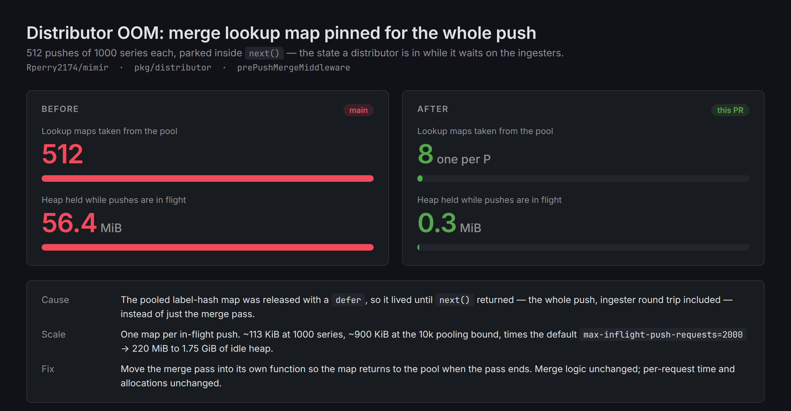
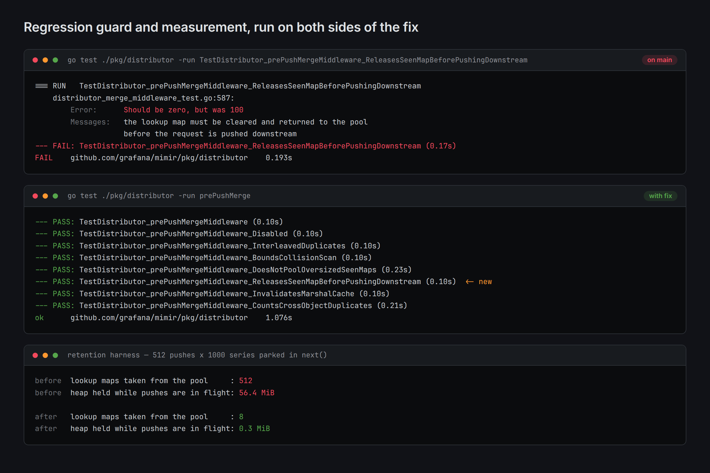

# Distributor OOM: merge lookup map pinned for the whole push

Evidence for the fix in `pkg/distributor/distributor.go` (`prePushMergeMiddleware`).





## What was wrong

`prePushMergeMiddleware` (added in #15589, gated behind the per-tenant
`-distributor.merge-duplicate-timeseries` limit) takes its label-hash lookup map from
`prePushMergeSeenPool` and returns it with a `defer`:

```go
seen := prePushMergeSeenPool.Get().(map[prePushMergeSeenKey]prePushMergeSeenEntry)
defer reusePrePushMergeSeen(seen)
...
return next(ctx, pushReq)
```

The `defer` fires when the middleware returns, which is after `next()` — validation,
sharding, and the round trip to the ingesters or Kafka. The merge pass itself only needs
the map for a few microseconds, so the map is checked out roughly a thousand times longer
than it is used.

Two consequences:

- The number of maps alive at any instant equals the number of **in-flight pushes**, not
  the number of concurrent merges. The pool cannot recycle a map while its owner is parked
  waiting on the ingesters, so it mints a fresh one for nearly every request.
- Each of those maps holds one entry per timeseries, and a Go map keeps its buckets after
  `clear()`, so a pooled map stays at its high-water size: ~113 KiB at 1000 series and
  ~900 KiB at the 10000-series `prePushMergeMaxPooledSeenEntries` bound.

At the default `-distributor.instance-limits.max-inflight-push-requests` of 2000 that is
~220 MiB to ~1.75 GiB of idle heap on top of the requests themselves.

## The fix

Move the merge pass into its own function, `mergeDuplicateTimeseries`, so the `defer`
fires when the pass ends rather than when the push ends. The merge logic is unchanged.

## Files here

| file | what it is |
| --- | --- |
| `00-before-after-summary.png` | Slack-ready summary of the measurement |
| `00-test-evidence.png` | the guard test failing on `main` and the suite passing with the fix |
| `01-retention-before.txt` | retention harness on `main` |
| `02-retention-after.txt` | retention harness with the fix |
| `03-guard-test-fails-without-fix.txt` | new guard test run against `main` |
| `04-merge-tests-pass-with-fix.txt` | `go test -run prePushMerge` with the fix |
| `05-bench-before.txt` / `06-bench-after.txt` | `BenchmarkDistributor_prePushMergeMiddleware`, before and after |
| `seen_map_retention_harness_test.go.txt` | the throwaway harness used for 01/02 |
| `card.html`, `terminal.html` | sources the two PNGs were rendered from |

## Reproducing the measurement

The harness is deliberately not committed to the package — it measures process-wide heap
and takes ~0.3 s, which does not belong in the unit test suite. To run it:

```sh
cp artifacts/distributor-oom-seen-map/seen_map_retention_harness_test.go.txt \
   pkg/distributor/zz_oom_evidence_test.go
go test ./pkg/distributor/ -run TestEvidenceInFlightSeenMapRetention -count=1 -v
rm pkg/distributor/zz_oom_evidence_test.go
```

It starts 512 concurrent pushes of 1000 unique series each, parks them all inside `next()`
(the state a distributor is in while waiting on the ingesters), and reports how many maps
the pool handed out and how much heap they hold. Swap `prePushMergeSeenPool`'s release
point to reproduce the "before" numbers.

Results on this machine (`GOMAXPROCS=8`):

| | lookup maps taken from the pool | heap held while pushes are in flight |
| --- | --- | --- |
| before | 512 | 56.4 MiB |
| after | 8 | 0.3 MiB |

## Benchmark

`BenchmarkDistributor_prePushMergeMiddleware` is unchanged: identical `allocs/op` in every
scenario, with `ns/op` and `B/op` within run-to-run noise on this machine. The fix does not
make a single request cheaper; it stops concurrent requests from each holding a map.
